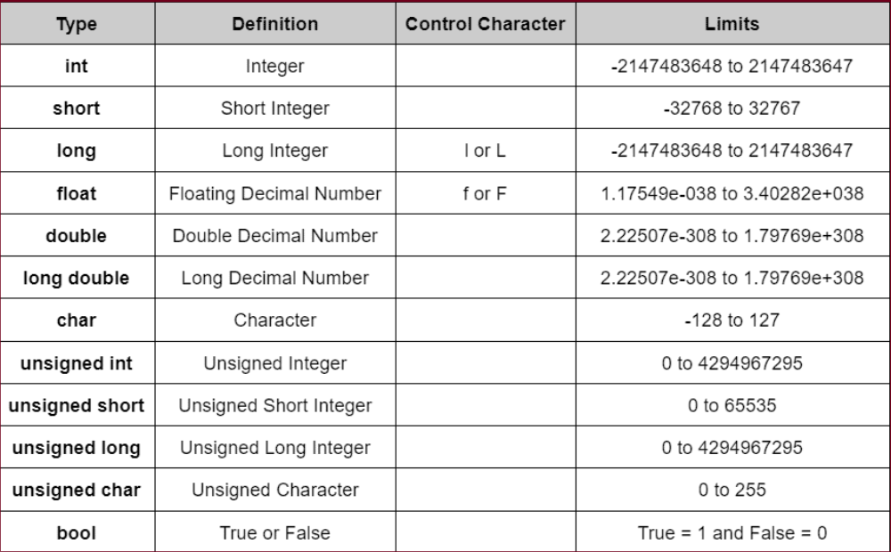

## História do C++
- C++ foi desenvolvida por Bjarne Stroustrup em 1979, inicialmente chamdo de `C with classes`.
- Seu objetivo era adicionar recursos de programação orientada a objetos à linguagem C.
- A linguagem foi padronizada pela primeira vez em 1998 como c++98. Desde então, novas versões foram lançadas sendo a C++23 a mais recente.

## Utilização
- É a linguagem mais utilizada no mundo, estando presente em praticamente qualquer sistema moderno.
- Principalmente utilizada em contexto de programação de sistemas, motores de gráficos, jogos e ambientes embarcados.
- É tão utilizada por fornecer as vantagens da programação orientada a objetos sem perder a capacidade da gestão de memória e computador do C.

## Linguagem compilada?
- Uma linguagem compilada é aquela em que o código-fonte precisa ser traduzido para código de máquina por um compilador antes de ser executado.
- Este código de máquina, que varia dependendo da arquitetura alvo, é compilado em um arquivo binário que é por fim executado.

## Variáveis
- De forma resumida, variáveis são espaços reservados e nomeados na memória no qual guardamos valores que nos são úteis no programa.
- Os nome podem somente conter letras e símbolos básico como - e _. Normalmente tentamos dar nomes que descrevam a função da variável.
- Para saber quanto de espaço a variável vai ocupar na memória, atribuimos um tipo a cada uma delas.

## Tipos de dados
- Na computação, variáveis especificam que dado e qual tamanho de dado podem ser alocados na memória.

